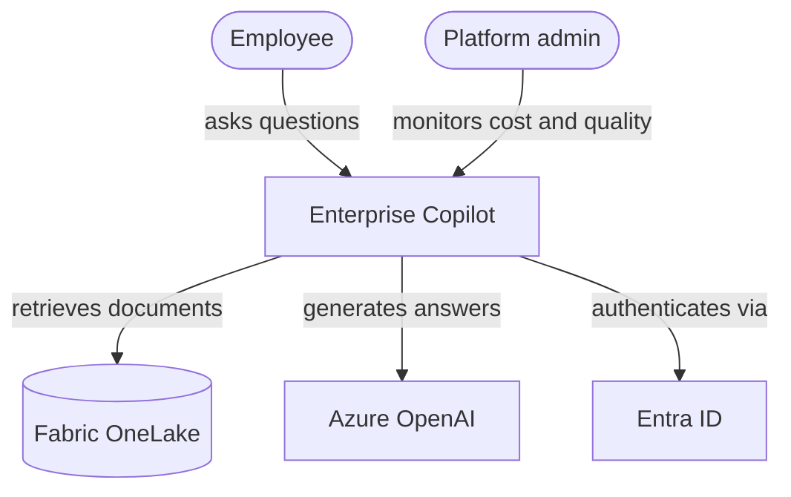
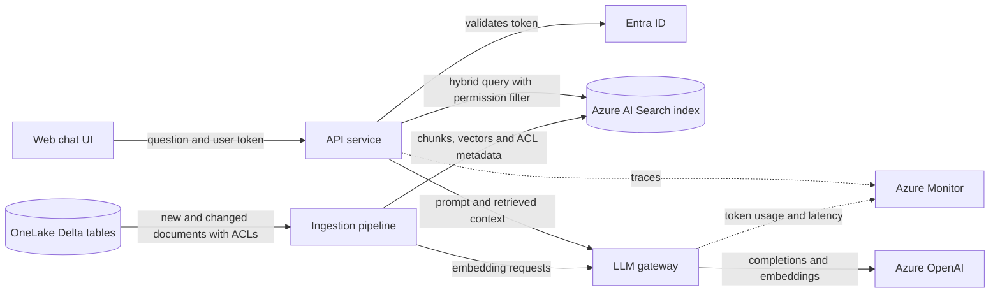

# Example: Level 1 Context for an enterprise copilot

```mermaid
flowchart TB
    user([Employee]) -->|asks questions| copilot[Enterprise Copilot]
    copilot -->|retrieves documents| lake[(Fabric OneLake)]
    copilot -->|generates answers| llm[Azure OpenAI]
    copilot -->|authenticates via| idp[Entra ID]
    admin([Platform admin]) -->|monitors cost and quality| copilot
```

# Enterprise Copilot: Level 2 Containers

```mermaid
flowchart LR
    ui[Web chat UI] -->|question and user token| api[API service]
    api -->|validates token| entra[Entra ID]
    api -->|hybrid query with permission filter| idx[(Azure AI Search index)]
    api -->|prompt and retrieved context| gw[LLM gateway]
    gw -->|completions and embeddings| aoai[Azure OpenAI]
    lake[(OneLake Delta tables)] -->|new and changed documents with ACLs| ingest[Ingestion pipeline]
    ingest -->|embedding requests| gw
    ingest -->|chunks, vectors and ACL metadata| idx
    api -.->|traces| obs[Azure Monitor]
    gw -.->|token usage and latency| obs
```
