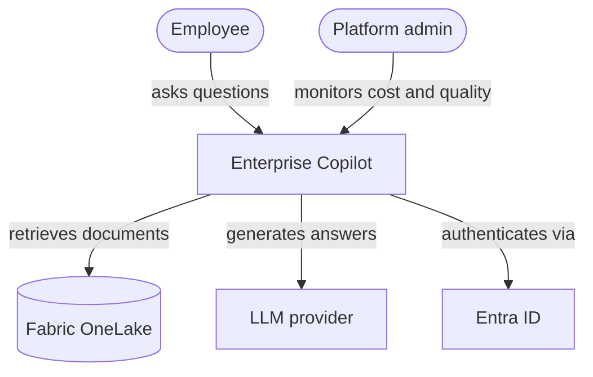
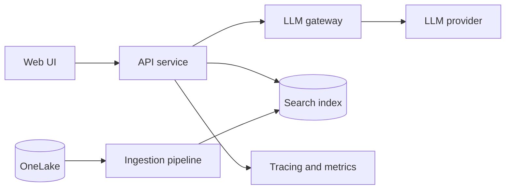

# Example: Level 1 Context for an enterprise copilot

```mermaid
flowchart TB
    user([Employee]) -->|asks questions| copilot[Enterprise Copilot]
    copilot -->|retrieves documents| lake[(Fabric OneLake)]
    copilot -->|generates answers| llm[LLM provider]
    copilot -->|authenticates via| idp[Entra ID]
    admin([Platform admin]) -->|monitors cost and quality| copilot
```

# Example: Level 2 Containers

```mermaid
flowchart LR
    ui[Web UI] --> api[API service]
    api --> gw[LLM gateway]
    api --> search[(Search index)]
    gw --> llm[LLM provider]
    ingest[Ingestion pipeline] --> search
    lake[(OneLake)] --> ingest
    api --> obs[Tracing and metrics]
```
